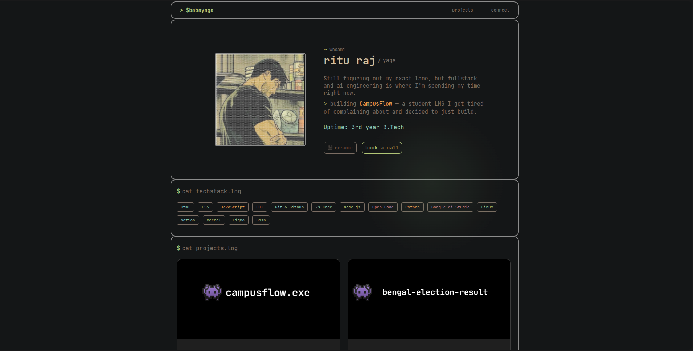

# $babayaga — Portfolio

A terminal-inspired personal portfolio built from scratch with plain HTML, CSS, and JavaScript. No frameworks, no build tools — just a dark, monospace aesthetic designed to feel like you're poking around someone's terminal.

**Live site:** [[Visit the site](https://gudakesh.me/)]

---

## Preview



---

## Features

- **Terminal aesthetic** — CLI-style prompts (`~ whoami`, `> cat blogs.log`), JetBrains Mono throughout, muted dark palette with per-category accent colors
- **Sticky, smooth-scrolling nav** — jumps to Projects / Connect / Blogs sections with native anchor scrolling
- **Project cards** — hover zoom + tint effects, live-status indicator, links out to deployed projects
- **Social hover cards** — GitHub, Twitter/X, LinkedIn, and Discord buttons reveal a mini profile preview on hover
- **Tech stack tags** — color-coded pill tags for every tool/language in daily use
- **Fully responsive** — dedicated mobile breakpoint with stacked layouts, line-clamped blog previews, and touch-friendly spacing
- **Cursor glow effect** — soft light that follows the cursor on desktop

---

## Tech Stack

`HTML` `CSS` `JavaScript` `Git & GitHub` `VS Code`

---

## Project Structure

```
/
├── index.html
├── css/
│   ├── style.css          # main stylesheet
│   └── responsive.css     # mobile breakpoint overrides
├── Assets/                 # images, icons, resume PDF
└── README.md
```

---

## Sections

| Section | What's in it |
|---|---|
| **whoami** | Intro, current focus, resume + book-a-call buttons |
| **techstack.log** | Languages, tools, and platforms I use |
| **projects.log** | CampusFlow and other builds, with live links |
| **blogs.log** | Writing on dev, engineering, and lessons learned |
| **connect.log** | Socials — GitHub, Twitter, LinkedIn, Discord |
| **quote.log** | A closing quote |

---

## Running Locally

No build step required — it's static HTML/CSS/JS.

```bash
git clone https://github.com/gudakesh07/Baba-Yaga-Portfolio-V1.git  
cd [Baba-Yaga-Portfolio-V1]
```

Then just open `index.html` in your browser, or serve it locally:

```bash
npx serve .
```

---

## About Me

I'm Ritu Raj (aka yaga) — a 3rd-year B.Tech CSBS student based in Kolkata. I'm mostly focused on fullstack development and finding my way into AI engineering, one project at a time.

- Twitter/X: [@Gudakesh_07](https://x.com/Gudakesh_07)
- GitHub: [gudakesh07](https://github.com/gudakesh07)
- LinkedIn: [Ritu Raj](https://www.linkedin.com/in/ritu-raj-51b546318/)

---

## License

Feel free to reference the structure or ideas — please don't copy the content or design 1:1.
